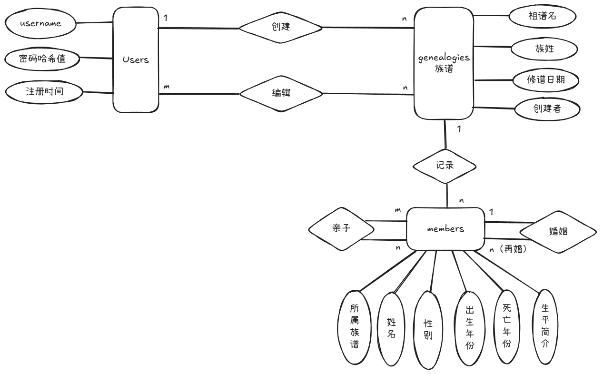

# 开发文档

## 一、数据库设计

### 1.1 ER 图



### 1.2 实体与联系

| 实体 | 联系 | 类型 |
| --- | --- | --- |
| users — genealogies | 用户创建族谱 | 1:N |
| users — genealogies | 用户参与族谱协作 | M:N，通过 genealogy_users 实现 |
| genealogies — members | 族谱包含成员 | 1:N |
| members — members | 亲子关系 | M:N，通过 parent_child 实现 |
| members — members | 婚姻关系 | M:N，通过 marriages 实现 |

### 1.3 关系模式

- users(id, username, password_hash, created_at)
- genealogies(id, name, surname, compiled_at, creator_id, created_at)
- genealogy_users(genealogy_id, user_id, role, created_at)
- members(id, genealogy_id, name, gender, birth_year, death_year, generation, bio, created_at)
- parent_child(parent_id, child_id)
- marriages(id, husband_id, wife_id, start_year, end_year)

### 1.4 表结构

#### users

| 列 | 类型 | 约束 | 含义 |
| --- | --- | --- | --- |
| id | SERIAL | PRIMARY KEY | 用户 ID |
| username | VARCHAR(50) | UNIQUE, NOT NULL | 登录用户名 |
| password_hash | VARCHAR(255) | NOT NULL | 密码哈希值 |
| created_at | TIMESTAMP | NOT NULL, DEFAULT NOW() | 注册时间 |

#### genealogies

| 列 | 类型 | 约束 | 含义 |
| --- | --- | --- | --- |
| id | SERIAL | PRIMARY KEY | 族谱 ID |
| name | VARCHAR(100) | NOT NULL | 谱名 |
| surname | VARCHAR(20) | NOT NULL | 姓氏 |
| compiled_at | DATE |  | 修谱时间 |
| creator_id | INT | NOT NULL, FK -> users(id) | 创建用户 |
| created_at | TIMESTAMP | NOT NULL, DEFAULT NOW() | 创建时间 |

#### genealogy_users

| 列 | 类型 | 约束 | 含义 |
| --- | --- | --- | --- |
| genealogy_id | INT | FK -> genealogies(id) ON DELETE CASCADE | 族谱 ID |
| user_id | INT | FK -> users(id) ON DELETE CASCADE | 用户 ID |
| role | VARCHAR(20) | NOT NULL, CHECK | owner 或 collaborator |
| created_at | TIMESTAMP | NOT NULL, DEFAULT NOW() | 加入时间 |
| genealogy_id, user_id |  | PRIMARY KEY | 联合主键 |

#### members

| 列 | 类型 | 约束 | 含义 |
| --- | --- | --- | --- |
| id | SERIAL | PRIMARY KEY | 成员 ID |
| genealogy_id | INT | NOT NULL, FK -> genealogies(id) ON DELETE CASCADE | 所属族谱 |
| name | VARCHAR(50) | NOT NULL | 姓名 |
| gender | CHAR(1) | NOT NULL, CHECK | M 表示男，F 表示女 |
| birth_year | INT | CHECK | 出生年份 |
| death_year | INT | CHECK | 卒年 |
| generation | INT | NOT NULL, DEFAULT 1, CHECK | 辈分或代数 |
| bio | TEXT |  | 生平简介 |
| created_at | TIMESTAMP | NOT NULL, DEFAULT NOW() | 创建时间 |

#### parent_child

| 列 | 类型 | 约束 | 含义 |
| --- | --- | --- | --- |
| parent_id | INT | FK -> members(id) ON DELETE CASCADE | 父亲或母亲成员 ID |
| child_id | INT | FK -> members(id) ON DELETE CASCADE | 子女成员 ID |
| parent_id, child_id |  | PRIMARY KEY | 联合主键 |

#### marriages

| 列 | 类型 | 约束 | 含义 |
| --- | --- | --- | --- |
| id | SERIAL | PRIMARY KEY | 婚姻记录 ID |
| husband_id | INT | NOT NULL, FK -> members(id) ON DELETE CASCADE | 丈夫成员 ID |
| wife_id | INT | NOT NULL, FK -> members(id) ON DELETE CASCADE | 妻子成员 ID |
| start_year | INT |  | 婚姻开始年份 |
| end_year | INT | CHECK | 婚姻结束年份 |

### 1.5 约束与触发器

| 约束或触发器 | 作用 |
| --- | --- |
| chk_lifetime | 成员出生年份必须早于卒年 |
| chk_birth_year、chk_death_year | 出生年份、卒年必须为正数 |
| chk_not_self | 亲子关系中 parent_id 与 child_id 不能相同 |
| chk_not_same | 婚姻关系中 husband_id 与 wife_id 不能相同 |
| chk_marriage_period | 婚姻开始年份不能晚于结束年份 |
| trg_add_genealogy_owner | 新建族谱后自动把创建者写入 genealogy_users |
| trg_marriage_members | 校验婚姻双方性别及所属族谱 |
| trg_parent_child_members | 校验亲子双方所属族谱、父母出生年份早于子女、同一子女至多记录一名父亲和一名母亲 |

### 1.6 配置参数

| 参数 | 默认值 | 含义 |
| --- | --- | --- |
| SECRET_KEY | dev-secret-key | Flask 会话密钥 |
| INIT_DB_POOL | true | 是否在应用启动时初始化数据库连接池 |
| DB_HOST | localhost | PostgreSQL 主机 |
| DB_PORT | 5432 | PostgreSQL 端口 |
| DB_NAME | family_tree | 数据库名 |
| DB_USER | postgres | 数据库用户名 |
| DB_PASSWORD | postgres | 数据库密码 |

### 1.7 范式说明

本项目关系模式满足 3NF。

users、genealogies、members、marriages 各表以单列主键标识实体，非主属性均完全依赖主键。genealogy_users 与 parent_child 使用联合主键，表内属性依赖完整联合主键，不存在对联合主键一部分的部分依赖。各表未保存可由其他非主属性推出的冗余字段，例如成员数量、男女比例通过查询统计得到。因此不存在非主属性对非主属性的传递依赖。

### 1.8 索引设计

| 索引 | 类型 | 作用 |
| --- | --- | --- |
| idx_users_username | B-tree | 用户登录时按用户名查找 |
| idx_genealogies_creator | B-tree | 按创建者筛选族谱 |
| idx_genealogy_users_user | B-tree | 查询用户可访问的族谱 |
| idx_members_genealogy | B-tree | 查询某族谱下的成员 |
| idx_members_genealogy_generation | B-tree | 按族谱和代数统计 |
| idx_members_name_trgm | GIN + pg_trgm | 支持姓名模糊查询 |
| idx_parent_child_parent | B-tree | 根据父节点 ID 查询子节点 |
| idx_parent_child_child | B-tree | 根据子节点 ID 查询父节点 |
| idx_marriages_husband | B-tree | 查询丈夫对应婚姻记录 |
| idx_marriages_wife | B-tree | 查询妻子对应婚姻记录 |
| idx_marriages_pair_period | UNIQUE | 避免同一婚姻开始年份重复记录 |

## 二、应用功能

系统使用 Flask 与 Jinja2 实现服务端渲染页面。用户注册、登录、退出由 `app/auth.py` 实现。用户只能访问 `genealogy_users` 中关联的族谱。

Dashboard 显示当前用户可访问族谱的总人数、男性人数、女性人数。族谱管理支持新增、编辑、删除和邀请协作者。成员管理支持新增、编辑、删除、按姓名模糊查找、查看父母、子女和配偶，并可通过成员 ID 维护亲子关系和婚姻关系。

查询功能包括分支树形预览、人物祖先查询、直系后代查询和两名成员之间的亲缘链路查询。递归关系查询均使用 PostgreSQL Recursive CTE 实现。

## 三、核心 SQL

核心查询语句位于 `sql/queries.sql`，包括：

- 给定成员 ID 查询配偶及所有子女。
- 使用 Recursive CTE 查询成员全部祖先。
- 统计某个家族中平均寿命最长的一代人。
- 查询年龄超过 50 岁且没有配偶的男性成员。
- 查询出生年份早于该辈分平均出生年份的成员。
- 查询两名成员之间的亲缘链路。
- 查询某成员的全部直系后代。
- 查询某曾祖父的所有曾孙，用于索引性能对比。

## 四、数据生成与导入导出

数据脚本位于 `data/` 目录。

| 文件 | 作用 |
| --- | --- |
| data/generate.py | 生成模拟用户、族谱、成员、亲子关系和婚姻关系 CSV |
| data/import_csv.py | 使用 PostgreSQL COPY 协议导入 CSV |
| data/export_branch.py | 使用 Recursive CTE 导出某成员分支备份 |
| data/README.md | 数据脚本使用说明 |

默认生成规模为 10 个族谱、102,000 名成员。其中第一个族谱包含 50,000 名成员，每个族谱包含 30 代人物。每名非始祖成员至少有一条亲子关系，因此满足族谱内成员与其他成员存在亲缘关联的要求。

## 五、物理优化与性能对比方法

姓名模糊查询使用 `pg_trgm` 扩展与 GIN 索引：

```sql
CREATE EXTENSION IF NOT EXISTS pg_trgm;
CREATE INDEX idx_members_name_trgm ON members USING gin (name gin_trgm_ops);
```

根据父节点 ID 查询子节点使用 B-tree 索引：

```sql
CREATE INDEX idx_parent_child_parent ON parent_child (parent_id);
```

可使用以下步骤记录四代查询在有无索引时的执行计划：

```sql
EXPLAIN ANALYZE
SELECT DISTINCT great_grandchild.*
FROM parent_child pc1
JOIN parent_child pc2 ON pc2.parent_id = pc1.child_id
JOIN parent_child pc3 ON pc3.parent_id = pc2.child_id
JOIN members great_grandchild ON great_grandchild.id = pc3.child_id
WHERE pc1.parent_id = 1
ORDER BY great_grandchild.id;
```

删除或创建 `idx_parent_child_parent` 后分别执行上述语句，记录 `Execution Time` 与访问路径。索引存在时，执行计划应使用 `Index Scan` 或 `Bitmap Index Scan` 定位 `parent_child.parent_id`。

## 六、技术选型

| 领域 | 选型 |
| --- | --- |
| 语言 | Python 3 |
| Web 框架 | Flask 2.3 至 3.x |
| 模板引擎 | Jinja2 |
| CSS 框架 | Bootstrap 5 CDN |
| 数据库 | PostgreSQL 16 |
| 数据库驱动 | psycopg2 |
| 密码处理 | Werkzeug password hash |
| 配置管理 | python-dotenv 与环境变量 |
| 数据生成 | Faker |
| 部署 | Docker Compose |

## 七、部分选择的依据

本项目为数据库课程大作业，项目团队规模为 2 人，交付后无持续迭代计划。系统核心工作集中在关系建模、约束、Recursive CTE 查询、批量数据生成与索引分析，因此采用服务端渲染页面与 psycopg2 原生 SQL，以直接展示数据库设计和 SQL 实现。

前端采用 Bootstrap CDN 与 Jinja2 模板，能够满足登录、CRUD、树形预览和查询结果展示需求。数据生成采用 Python 脚本输出 CSV，再通过 PostgreSQL COPY 导入，便于复现实验数据和提交工具源码。项目通过 Docker Compose 启动 Flask 应用容器和 PostgreSQL 数据库容器。数据库容器首次创建数据卷时执行 `sql/schema.sql` 完成初始化；若数据卷已存在，需要手动导入 schema 或重建数据库数据卷。

## 八、预期项目结构

```text
family-tree/
├── app/
│   ├── __init__.py
│   ├── access.py
│   ├── auth.py
│   ├── db.py
│   ├── genealogy.py
│   ├── member.py
│   ├── query.py
│   ├── routes.py
│   └── templates/
│       ├── auth/
│       ├── genealogy/
│       ├── macros/
│       ├── member/
│       ├── query/
│       ├── base.html
│       └── dashboard.html
├── data/
│   ├── README.md
│   ├── export_branch.py
│   ├── generate.py
│   ├── import_csv.py
│   └── output/
├── docs/
│   ├── dev-doc.md
│   ├── task.md
│   └── graph/
│       ├── ER.excalidraw
│       └── ER.png
├── sql/
│   ├── queries.sql
│   └── schema.sql
├── .env.example
├── .gitignore
├── config.py
├── docker-compose.yml
├── Dockerfile
├── README.md
├── requirements.txt
└── run.py
```
